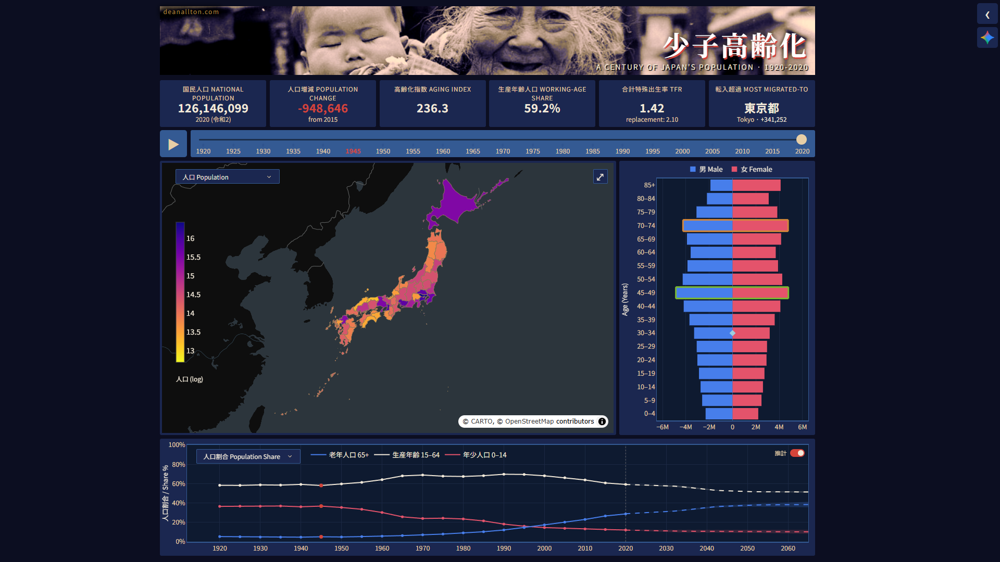

# Japan Population Dashboard
### 日本の人口ダッシュボード

An interactive visualization of Japanese census data (1920–2020) with projections to 2065, across all 47 prefectures.

**Live:** [japan-population.deanallton.com](https://japan-population.deanallton.com)



---

## Dashboard

### Controls

| Control | Effect |
|---|---|
| Year slider | Updates all panels simultaneously across 21 census years (1920–2020) |
| Play button | Autoplays through census years at a fixed interval |
| Prefecture click (map) | Filters the pyramid and overlays a prefecture line on the time series |
| Re-click / Reset | Clears prefecture selection and returns all panels to the national view |
| Map metric selector | Switches the choropleth between total population, aging index, population change, and working-age share |
| Time series selector | Switches the time series between population (default), population share, and TFR views |

### Panels

**KPI cards** — National population, period-over-period change, aging index, working-age share, TFR, and the most migrated-to prefecture for the selected year.

**Choropleth map** — Prefecture-level choropleth with per-metric colour scales. Hover for prefecture name, population, aging index, and period-over-period delta. Aging index is defined as `population 65+ / population 0–14 × 100` (高齢化指数); values above 100 indicate the elderly population exceeds the child population. Okinawa is greyed out for 1950 and 1955 due to methodological anomalies in the US-administered census data.

**Population pyramid** — Age/sex butterfly chart for the selected year and geography. Cohort annotations mark the 団塊世代 (dankai), 団塊ジュニア, 戦中世代, and 少子化世代 birth cohorts. The WWII male deficit is visible walking up the pyramid across census years.

**Time series** — Three switchable views. The population view shows national total, male, and female trends with IPSS projection confidence bands bolted on from 2020. The population share view shows youth (0–14), working-age (15–64), and elderly (65+) as shares of total population, annotated with the working-age peak and the elderly/youth crossover. The TFR view shows the national average fertility rate with the 2.1 replacement rate reference line. Prefecture overlay shown on map selection.

---

## Documentation

**[Data Dictionary](https://japan-population.deanallton.com/docs/Data_Dictionary.html)** — Schema reference: all tables, views, fields, data sources, and coverage notes.

**[Metrics & Queries](https://japan-population.deanallton.com/docs/Metrics_and_Queries.html)** — Derived metric formulas, SQL patterns, and the full query cookbook.

---

## Setup

**Requirements:** Python 3.12+

```bash
git clone https://github.com/HelioCentrik/japan_population.git
cd japan_population
pip install -r requirements.txt
```

Set the required environment variable:

```bash
export GEMINI_API_KEY=your_key_here
```

Then run:

```bash
python main.py
```

---

## Deployment

Served with Gunicorn behind nginx on a self-hosted Linux server, exposed via Cloudflare Tunnel:

```bash
gunicorn main:server --workers 1 --timeout 120 --bind 127.0.0.1:8050
```

**Required environment variables:**
- `GEMINI_API_KEY` — Gemini API key for the AI Q&A panel

**Cold start:** On first request, all figures are built from the committed database into an in-memory cache (30–60s). Subsequent requests are served from memory. If the database is unchanged from the previous run, the disk-backed cache makes the first request near-instant.

---

## Project Structure

```
app/                 Application package — config, data layer, figure builders, styling
app/data/            DuckDB singleton, figure cache, SQL view definitions
app/viz/             Figure builders — choropleth map, pyramid, time series, KPI cards
app/aesthetics/      Color tokens, theme definitions, Plotly template, CSS variable injection
assets/              style.css and map_resize.js (ResizeObserver → map zoom)
callbacks/           Callback registration — charts, UI, AI panel
knowledge/           Markdown files concatenated into the Gemini AI system prompt
scripts/             ETL — builds the DuckDB file from source data. Run once.
data/                Committed database and geometry files; .figure_cache/ is gitignored
main.py              Entrypoint — wires layout and callbacks, exposes server for Gunicorn
```

---

## Stack

| Library | Role |
|---|---|
| [Dash](https://dash.plotly.com/) | Application framework |
| [Plotly](https://plotly.com/python/) | Chart rendering — choropleth, pyramid, time series |
| [DuckDB](https://duckdb.org/) | Analytical query engine; census data in a star schema with derived metric views |
| [GeoPandas](https://geopandas.org/) | Prefecture geometry — reads simplified Parquet and joins to census data |
| [Pandas](https://pandas.pydata.org/) | DataFrames for passing query results to Plotly |

---

## Data

21 census years (1920–2020), 47 prefectures. Pre-built database committed to the repo — no pipeline setup required. Four supplementary datasets are included:

| Dataset | Source | Coverage |
|---|---|---|
| Prefecture TFR (`f_tfr`) | Ministry of Health, Labour and Welfare | 1960–2024, annual |
| IPSS prefectural projections (`f_projections`) | IPSS 2018 edition | 2015–2045, 5-year intervals |
| IPSS national projections (`f_national_projections`) | IPSS 2017 edition | 2015–2065, annual, medium/high/low variants |
| Net internal migration (`f_migration`) | e-Stat, Basic Resident Register | Census years 1985–2020 |

The 1945 provisional census uses kazoedoshi (数え年) age reckoning and is handled separately in the data pipeline. See the [Data Dictionary](https://japan-population.deanallton.com/docs/Data_Dictionary.html) for full coverage notes, schema documentation, and known data anomalies.

---

## Sources

**Census data** — Statistics Bureau of Japan, Population Census (国勢調査), 1920–2020. Retrieved via [e-Stat](https://www.e-stat.go.jp/) under the [e-Stat Terms of Use](https://www.e-stat.go.jp/terms-of-use). Redistribution of the derived database is permitted for non-commercial use with attribution.

**TFR data** — Ministry of Health, Labour and Welfare, Vital Statistics (人口動態統計). Retrieved via [e-Stat](https://www.e-stat.go.jp/).

**Population projections** — National Institute of Population and Social Security Research (国立社会保障・人口問題研究所), Regional Population Projections for Japan: 2015–2045 (平成30年推計), March 2018. Retrieved from [ipss.go.jp](https://www.ipss.go.jp/pp-shicyoson/e/shicyoson18/t-page.asp).

**Internal migration data** — Statistics Bureau of Japan, Report on Internal Migration in Japan (住民基本台帳人口移動報告). Retrieved via [e-Stat](https://www.e-stat.go.jp/).

**Prefecture boundary geometry** — GeoJSON from [dataofjapan/land](https://github.com/dataofjapan/land), converted from Shapefiles by the [Geospatial Information Authority of Japan](https://www.gsi.go.jp/) (国土地理院). Simplified at `tolerance=0.001` via Shapely. Non-commercial use with attribution.

**Header photo** — Okinawa, c. 1950–1954. Original photo by Bert Mosher / The American Photo Service. Archived by [Remembering Okinawa](https://www.rememberingokinawa.com/page/american_photo_2).