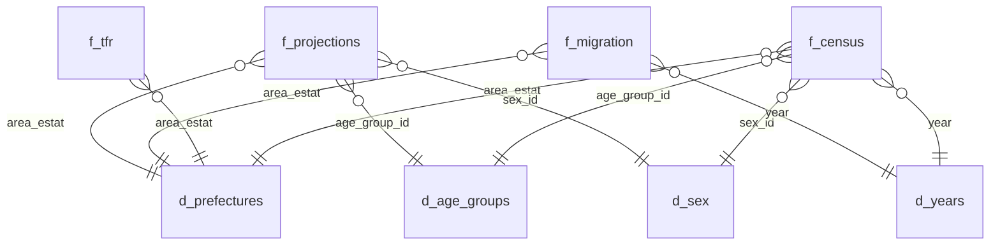

# Data Dictionary — Japan Population Dashboard

Reference for all tables, views, and fields in `japan_population.duckdb`.

---

## Schema



---

## Source & Coverage

### Primary Data Source

| Field | Value |
|---|---|
| Series name | 年齢（５歳階級），男女別人口－都道府県（大正９年～平成27年） |
| Stat ID | `000031523105` |
| Publisher | Statistics Bureau, Ministry of Internal Affairs (総務省統計局) |
| Format | CP932-encoded CSV |
| Direct download | `https://www.e-stat.go.jp/stat-search/file-download?statInfId=000031523105&fileKind=1` |
| Interactive DB | `https://www.e-stat.go.jp/dbview?sid=0003410381` (covers 1920–2020) |

### Coverage & Known Gaps

**Years in DB:** 1920-2020

**Missing years and why:**

| Year | Status | Reason                                                                                                                                      |
| ---- | ------ | ------------------------------------------------------------------------------------------------------------------------------------------- |
| 2025 | TBA    | Future API pull. Expected to release in May 2026 and finalized in September 2026.                                                           |

---

## Views

### `v_census`

Pre-joined view across all dimension tables. **This is the primary query surface for the app** — do not re-join dimension tables manually.

```sql
SELECT year, area_estat, prefecture_name_ja, prefecture_name,
       area_level, parent_estat, age_group, age_start, age_end,
       is_open_ended, age_scheme, sex, sex_ja, population
FROM v_census
```

| Field                | Type       | Source Table    | Description                                                                                                                                                                                                                                                                                                                                    |
| -------------------- | ---------- | --------------- | ---------------------------------------------------------------------------------------------------------------------------------------------------------------------------------------------------------------------------------------------------------------------------------------------------------------------------------------------- |
| `year`               | int        | `f_census`      | Census year. Begins 1920.                                                                                                                                                                                                                                                                                                                      |
| `area_estat`         | str        | `d_prefectures` | 5-digit e-Stat area code, zero-padded. E.g. `01000` (Hokkaido), `13000` (Tokyo), `00000` (national aggregate). Join key for geometry.                                                                                                                                                                                                          |
| `prefecture_name`    | str        | `d_prefectures` | English prefecture name, e.g. `Hokkaido`, `Tokyo`                                                                                                                                                                                                                                                                                              |
| `prefecture_name_ja` | str        | `d_prefectures` | Japanese prefecture name, e.g. `北海道`, `東京都`                                                                                                                                                                                                                                                                                                    |
| `area_level`         | int        | `d_prefectures` | Hierarchy level. `1` = national aggregate (`00000`). `2` = prefecture. **Always filter `area_level = 2` for prefecture-level queries** — omitting this filter double-counts.                                                                                                                                                                   |
| `parent_estat`       | str        | `d_prefectures` | Parent area code. All prefectures point to `00000` (national).                                                                                                                                                                                                                                                                                 |
| `age_group`          | str        | `d_age_groups`  | English age band label, e.g. `0–4 years old`. `Total` is a pre-stored aggregate row — **do not use `Total` rows in arithmetic**, sum individual bands instead.                                                                                                                                                                                 |
| `age_start`          | int        | `d_age_groups`  | Lower bound of the age band in years, inclusive.                                                                                                                                                                                                                                                                                               |
| `age_end`            | int / null | `d_age_groups`  | Upper bound of the age band in years, inclusive. `NULL` for open-ended terminal bands (e.g. `85 years and older`).                                                                                                                                                                                                                             |
| `is_open_ended`      | bool       | `d_age_groups`  | `true` if the band has no upper bound. Filtering `age_start >= 65` is the safe pattern — it captures both closed and open-ended 65+ bands regardless of which terminal band a given year uses.                                                                                                                                                 |
| `age_scheme`         | str        | `d_age_groups`  | `scheme_a` = standard 5-year bands, 0–4 through 85+. `scheme_b` = offset bands, 1–5 through 86+. **Use `scheme_a` for all derived metrics.** Band count varies by year (18–20; 1920 and 1930 have fewest). Pyramid uses `85+` as the canonical terminal band — where only `80+` exists, population slots into `80–84` and `85+` renders empty. |
| `sex`                | str        | `d_sex`         | `total`, `male`, or `female`                                                                                                                                                                                                                                                                                                                   |
| `sex_ja`             | str        | `d_sex`         | Japanese sex label: `総数`, `男`, `女`                                                                                                                                                                                                                                                                                                             |
| `population`         | int        | `f_census`      | Headcount for this combination of year / area / age band / sex                                                                                                                                                                                                                                                                                 |

### `v_map_metrics`

Pre-aggregated map metrics view. **This is the primary query surface for the choropleth map** — one row per prefecture per year with population, aging index, and period deltas already computed. Do not use `v_census` for map queries.
```sql
SELECT area_estat, prefecture_name, prefecture_name_ja, year,
       population, aging_index,
       pop_delta, aging_index_delta,
       prev_year, year_gap
FROM v_map_metrics
WHERE year = {year}
```

| Field                     | Type  | Description                                                                               |
| ------------------------- | ----- | ----------------------------------------------------------------------------------------- |
| `old_age_dep`             | float | `SUM(pop 65+) / SUM(pop 15–64) × 100`. Available in view but not a selectable map metric. |
| `working_age_share`       | float | `SUM(pop 15–64) / total pop × 100`.                                                       |
| `pop_delta`               | int   | Population change since previous census. NULL for 1920 (no prior year).                   |
| `aging_index_delta`       | float | Aging index change since previous census. NULL for 1920.                                  |
| `old_age_dep_delta`       | float | Old-age dependency change since previous census. NULL for 1920.                           |
| `working_age_share_delta` | float | Working-age share change since previous census. NULL for 1920.                            |
| `prev_year`               | int   | The previous census year used to compute deltas. NULL for 1920.                           |
| `year_gap`                | int   | Years elapsed since previous census. Not uniform — ranges from 2 to 5.                    |

**Grain:** One row per `area_estat × year`. 47 rows per year (prefectures only, no national aggregate).

In 1945's census, age was collected as kazoedoshi (数え年) per official methodology, producing scheme_b bands offset by +1 from completed years. Converted to scheme_a for continuity.

**NULL handling:** 1920 has NULL for all delta columns — it's the first census year. Pre-format delta strings in Python before passing to Plotly hovertemplate; the template has no conditional logic.

**Depends on:** `v_census` must exist before this view is created. Run `scripts/query_db.py` before `scripts/create_views.py`.

---

## Fact Tables

### `f_census`

Core fact table. One row per year × prefecture × age group × sex combination.

| Field          | Type | Description                                            |
| -------------- | ---- | ------------------------------------------------------ |
| `year`         | int  | Census year                                            |
| `area_estat`   | str  | 5-digit e-Stat prefecture code → FK to `d_prefectures` |
| `age_group_id` | int  | → FK to `d_age_groups`                                 |
| `sex_id`       | int  | → FK to `d_sex`                                        |
| `population`   | int  | Headcount                                              |

&nbsp;

### `f_tfr`

Prefecture-level Total Fertility Rate. Standalone fact table — no age or sex dimension.

| Field       | Type   | Description                                           |
|-------------|--------|-------------------------------------------------------|
| `area_estat`| str    | 5-digit e-Stat prefecture code → FK to `d_prefectures` |
| `year`      | int    | Calendar year (annual, not census-keyed)              |
| `tfr`       | double | Total fertility rate (avg births per woman)           |

**Source:** e-Stat statsDataId `0003411598` — 都道府県別にみた年次別合計特殊出生率

**Coverage:** 1960–2024, annual. 3 suppressed values excluded.

**Notes:** Annual grain vs. the census cadence — filter to census years when joining to `f_census` or `v_map_metrics`. No data pre-1960; the map metric selector snaps `min` year to 1960 when TFR is active.

&nbsp;

### `f_migration`

Prefecture-level net migration rollups aligned to census intervals. One row per prefecture per census year.

| Field | Type | Description |
|---|---|---|
| `area_estat` | str | 5-digit e-Stat prefecture code. PK component. FK to `d_prefectures`. |
| `census_year` | int | Census year. PK component. FK to `d_years`. |
| `net_migration` | int | Sum of annual 転入超過数 (net in-migrants) for the 5-year window ending on `census_year`. Negative = net outflow. NULL for census years 1960–1980 (no prefecture-level source data). |

**Grain:** One row per `area_estat × census_year`. 47 rows per census year (prefectures only, no national aggregate).

**Rollup window:** Census year Y = Σ annual net migration for years (Y−4) through Y inclusive. Census year 1985 is partial — data begins 1982, so the window covers 4 of 5 years.

**Source:** e-Stat 住民基本台帳人口移動報告 (Basic Resident Register Migration Report). Stitched from 8 overlapping datasets spanning 1982–2025, deduplicated by source priority (earliest publication wins). No prefecture-level data exists prior to 1982.

**NULL handling:** Census years 1960, 1965, 1970, 1975, 1980 are all NULL — no source data. Do not infer zero; these prefectures simply have no coverage for those periods.

&nbsp;

### `f_projections`

IPSS prefectural population projections. One row per prefecture × projection year × age group × sex combination.

| Field            | Type | Description                                                   |
|------------------|------|---------------------------------------------------------------|
| `area_estat`     | str  | 5-digit e-Stat prefecture code → FK to `d_prefectures`        |
| `projection_year`| int  | Projection year. Not a FK to `d_years` — future years only.   |
| `age_group_id`   | int  | → FK to `d_age_groups` (scheme_a bands only)                  |
| `sex_id`         | int  | → FK to `d_sex`                                               |
| `population`     | int  | Projected headcount                                           |

**Source:** National Institute of Population and Social Security Research (IPSS) — 日本の地域別将来推計人口（平成30（2018）年推計）. Per-prefecture Excel files at `https://www.ipss.go.jp/pp-shicyoson/j/shicyoson18/3kekka/Municipalities/`.

**Coverage:** 2015–2045 in 5-year intervals. 47 prefectures × 7 years × 18 age groups × 3 sex values = 17,766 rows.

**Age bands:** scheme_a only (18 bands: 0–4 through 85+). IPSS publishes 85–89 and 90+ as separate bands; both are summed into the `85+` group (`age_start=85, is_open_ended=true`) to match `d_age_groups`. The `総数` (total) and `（再掲）` (sub-aggregate) rows are excluded — sum individual bands instead.

**2015 baseline:** The 2015 rows serve as the projection baseline, not a census observation. IPSS adjusts the 2015 starting population upward by ~1–2% to account for census undercounting, so `f_projections` 2015 figures will not exactly match `f_census` 2015. This is expected and documented IPSS methodology.

**ETL:** `scripts/fetch_ipss.py` — downloads per-prefecture XLS files, caches locally under `data/ipss_raw/`, parses and writes `f_projections`. Re-running is idempotent (`DROP TABLE IF EXISTS` before write). Cached files are reused on subsequent runs.

---

## Dimension Tables

### `d_prefectures`

47 prefectures plus the national aggregate row.

|Field|Type|Description|
|---|---|---|
|`area_estat`|str|5-digit e-Stat code, zero-padded. PK. E.g. `01000`, `00000` (national)|
|`prefecture_code`|str|2-digit JIS prefecture code, zero-padded. E.g. `01`, `13`|
|`prefecture_name`|str|English name|
|`prefecture_name_ja`|str|Japanese name|
|`level`|int|`1` = national, `2` = prefecture|
|`parent_estat`|str|Parent area code. Prefectures point to `00000`|

**Okinawa coverage:** Despite US administration (1945–1972), Okinawa (`47000`) has data present for all years in this dataset including pre-1975. The commonly documented "gap" does not apply to this CSV source.

**Okinawa 1950 & 1955 — known anomaly:** The 70–74 age band for these two years actually contains "70 years and older" open-ended values rather than a true 5-year band, confirmed in e-Stat footnotes. This inflates 1950/1955 totals relative to adjacent years and produces the anomalous population trajectory: 574k (1940) → 880k (1950) → 777k (1955) → 882k (1960). This is a methodology artifact of the US administration period, not real population movement.

**UI treatment:** Grey out or stripe Okinawa on the map for 1950 and 1955 specifically, with a tooltip noting the data quality issue. Do not silently display these figures as comparable to other years.

**Okinawa 1945:** If backfilled via API, treat as unverified — the 1945 figure was sourced from 沖縄群島要覧 (a separate publication), not the standard census methodology.

---

### `d_age_groups`

Age band definitions across two overlapping schemes plus the Total aggregate.

|Field|Type|Description|
|---|---|---|
|`age_group_id`|int|PK|
|`age_group`|str|English label, e.g. `0–4 years old`, `Total`|
|`age_group_ja`|str|Japanese label, e.g. `0～4歳`, `総数`|
|`age_start`|int|Lower bound, inclusive|
|`age_end`|int / null|Upper bound, inclusive. `NULL` for open-ended bands.|
|`is_open_ended`|bool|`true` if no upper bound|
|`source_scheme`|str|`scheme_a`, `scheme_b`, or `base` (for the Total row)|

**Schemes:**

- `scheme_a` - standard: 0–4, 5–9 … 75–79, 80–84, 85+. Use for all derived metrics.
- `scheme_b` - kazoedoshi (数え年) bands: 1–5, 6–10 … 76–80, 81–85, 86+. Present in 1945 Population Survey source data only. Age was reported as kazoedoshi — 1 at birth, incrementing each New Year's Day.
  Source: stat.go.jp/data/kokusei/pdf/kaisetu3.pdf (昭和20年人口調査). Converts to scheme_a via −1
  label shift (e.g. 1–5 → 0–4).
- `base` - the `Total` aggregate row only.

---

### `d_sex`

|Field|Type|Description|
|---|---|---|
|`sex_id`|int|PK. `0` = total, `1` = male, `2` = female|
|`sex`|str|`total`, `male`, `female`|
|`sex_ja`|str|`総数`, `男`, `女`|

---

### `d_years`

|Field|Type|Description|
|---|---|---|
|`year`|int|Census year. PK.|
|`era_name`|str|Japanese era name, e.g. `大正`, `昭和`, `平成`|
|`era_year`|int|Year within the era, e.g. `27` (for 平成27 = 2015)|

Census years: 1920-2020, 5-year intervals.

Note: Always compute annualized growth as `(pop_b / pop_a) ^ (1 / (year_b - year_a)) - 1`. Never hardcode a 5-year denominator.

---

## Geometry

### `japan_prefectures_simplified.parquet`

Simplified prefecture boundaries for map rendering. Not in DuckDB — loaded via GeoPandas.

|Field|Type|Description|
|---|---|---|
|`area_estat`|str|5-digit e-Stat code. **Join key to census data.**|
|`prefecture_name`|str|English name|
|`prefecture_name_ja`|str|Japanese name|
|`geometry`|geometry|Simplified polygon (tolerance 0.001, topology preserved). EPSG:4326.|

Rendered via Plotly choropleth with `featureidkey="properties.area_estat"`.

**Source:** Derived from [dataofjapan/land](https://github.com/dataofjapan/land), which converted Shapefiles from the [Geospatial Information Authority of Japan](https://www.gsi.go.jp/) (国土地理院) — Global Map Japan (地球地図日本). Geometry simplified at `tolerance=0.001` via Shapely (`preserve_topology=True`). Non-commercial use requires attribution to 地球地図日本.